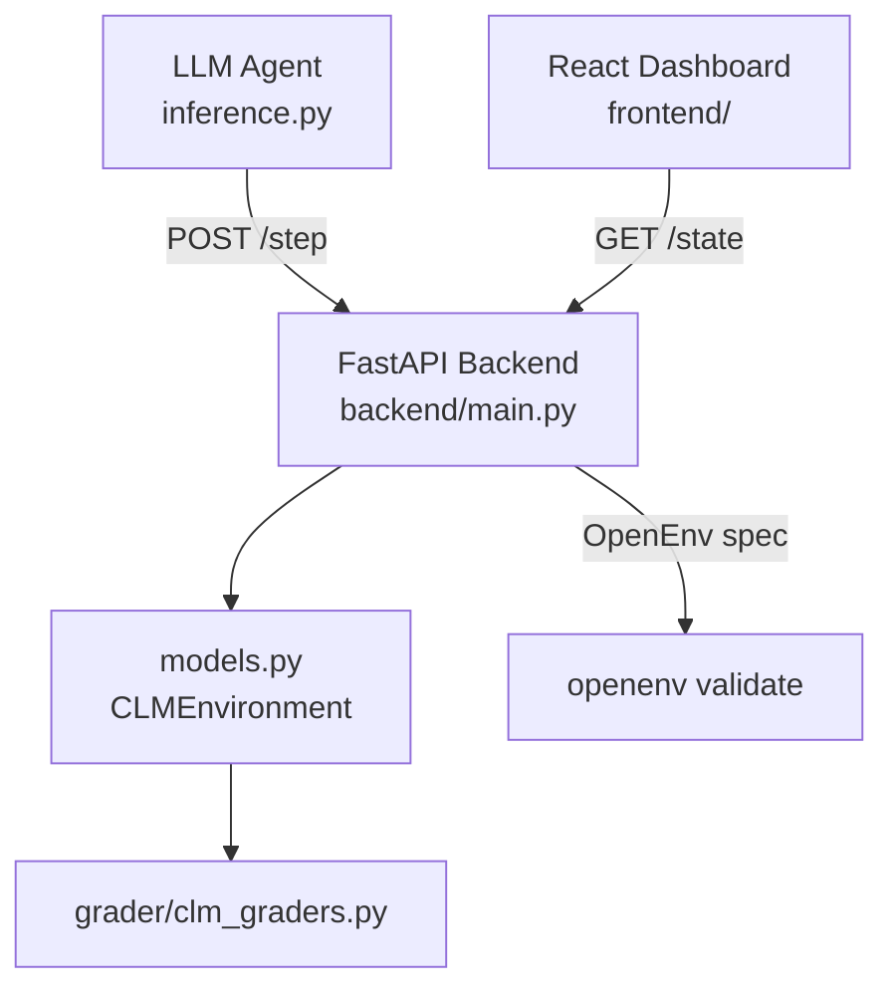

# 🧠 Cognitive Load Manager (CLM) 

**An OpenEnv RL Simulation for the Meta PyTorch Hackathon**

[](#)
[](#)
[](#)

CLM is a **real-world productivity simulation** where an AI agent plays the role of a human knowledge worker's task scheduler. It must manage heterogeneous work items like emails, meetings, code reviews, reports, and calls each with different cognitive demands, deadlines, priorities, and dependencies, while keeping the worker's energy and stress within safe bounds.

*This is not a toy game.* CLM models how humans actually experience workload: stress accumulates when deadlines approach, fatigue reduces efficiency, context-switching has a cognitive cost, and deep focus yields better output at the expense of higher energy.


## 🎯 Why This Environment Matters

Modern knowledge workers face **cognitive load management** as one of their most critical daily challenges, yet no RL environment has modelled this domain in a principled, agent-evaluatable way. CLM fills this gap:

- **Useful for training agents** that assist with personal productivity tools, calendar management, and task triage systems.
- **Useful for evaluating LLM planning ability** especially multi-step planning under resource constraints.
- **Realistic dynamics**: energy, stress, fatigue, and task dependencies create emergent difficulty that pure search algorithms cannot exploit.


## 🕹️ Actions

| Action | Description | Cost |
|--------|-------------|------|
| `work` | Work on `task_id` at normal pace | Energy ↓ by task type |
| `focus` | Deep-work mode on `task_id`: 2× progress, 2× energy cost | Energy ↓ 2× |
| `break` | Rest: Energy +0.22, Stress −0.18 | None |
| `switch` | Change active task | Small reward penalty |
| `delay` | Wait one step; slight stress relief | None |

Action format:
```json
{"type": "work", "task_id": "m1"}
{"type": "focus", "task_id": "h3"}
{"type": "break", "task_id": null}
```


## 👁️ Observation Space

```json
{
  "tasks": [
    {
      "id": "h1",
      "task_type": "email",
      "priority": "critical",
      "progress": 0.45,
      "deadline": 12,
      "depends_on": null,
      "is_interrupted": false
    }
  ],
  "visible_state": {
    "fatigue_level": "medium",
    "stress_warning": true,
    "energy_level": 0.42,
    "stress_level": 0.71,
    "focus_mode": false,
    "upcoming_deadlines": ["h1", "h3"],
    "blocked_tasks": ["h3"]
  },
  "time_step": 9
}
```

**Key mechanics visible to the agent:**
- `blocked_tasks` — tasks whose `depends_on` parent is not yet complete; agent must not work on these
- `upcoming_deadlines` — tasks with deadline within the next 5 steps
- `focus_mode` — whether the agent is currently in deep-work state


## 📋 Tasks & Baseline Scores

| Level | Tasks | Deadlines | Dependencies | Interruptions | Baseline Score |
|-------|-------|-----------|--------------|---------------|----------------|
| **easy** | 2 (email, report) | None | None | None | **0.856** |
| **medium** | 5 mixed types | Yes (4 tasks) | None | None | **0.523** |
| **hard** | 8 mixed types | Yes (tight) | 3 dependency chains | 2 mid-episode | **0.301** |
| **expert** | 10 mixed types | Yes (very tight) | 5 dependency chains | 3 mid-episode | **0.221** |

Scores produced by heuristic agent (priority + deadline triage with focus mode).
A strong LLM agent should achieve: easy >0.85, medium >0.55, hard >0.35, expert >0.25.


## 🏆 Scoring Formula

```
score = weighted_completion × 0.60
      + deadline_adherence  × 0.22
      + energy_efficiency   × 0.10
      + dependency_bonus    × 0.05
      + interruption_bonus  × 0.03
```

- **weighted_completion**: sum of (progress × priority_weight) / total_weight
- **deadline_adherence**: fraction of deadline tasks completed on time
- **energy_efficiency**: bonus for finishing with energy > 0.10
- **dependency_bonus**: reward for correctly sequencing dependent tasks
- **interruption_bonus**: reward for handling injected urgent tasks

Score is always in **(0.01, 0.99)** — never exactly 0 or 1.


## 🚀 Setup

### Docker (for HF Space / production)
```bash
docker build -t clm-env .
docker run -p 7860:7860 clm-env
```

### Local development
```bash
pip install -r requirements.txt
uvicorn server.app:app --port 7860 --reload
```

### Run inference baseline
```bash
export HF_TOKEN="hf_your_token_here"
export API_BASE_URL="https://router.huggingface.co/v1"
export MODEL_NAME="Qwen/Qwen2.5-72B-Instruct"
python inference.py
```

### Optional: React Dashboard
```bash
cd frontend && npm install && npm run dev
# Visit http://localhost:5173
```


## 🏛️ Architecture

```
cognitive-load-manager/
├── models.py          ← Core environment logic (tasks, state, grader, dynamics)
├── inference.py       ← OpenAI-client baseline agent (all 4 difficulty levels)
├── openenv.yaml       ← OpenEnv spec (actions, observations, tasks, scoring)
├── Dockerfile         ← Container definition
├── backend/
│   └── main.py        ← FastAPI app (OpenEnv HTTP server + grade endpoints)
├── server/
│   └── app.py         ← Uvicorn entrypoint
├── grader/
│   └── clm_graders.py ← EasyGrader, MediumGrader, HardGrader, ExpertGrader
└── frontend/          ← React live dashboard (visual state inspector)
```




## 📊 Reward Shaping Details

Step rewards provide **dense signal** across the full trajectory:

| Event | Reward |
|-------|--------|
| Task progress (normal) | +0.10 × progress_delta × priority_weight |
| Milestone 25% | +0.04 × priority_weight |
| Milestone 50% | +0.07 × priority_weight |
| Milestone 75% | +0.09 × priority_weight |
| Task complete 100% | +0.18 × priority_weight |
| Context switch | −0.07 |
| Work on blocked task | −0.15 |
| Interruption arrives | −0.05 |
| Episode: burnout | −1.0 |
| Episode: all done (on time) | +1.0 |
| Episode: all done (late) | +0.5 |


## ⚙️ Environment Variables

| Variable | Description |
|----------|-------------|
| `API_BASE_URL` | LLM API endpoint (e.g. `https://router.huggingface.co/v1`) |
| `MODEL_NAME` | Model identifier (default: `Qwen/Qwen2.5-72B-Instruct`) |
| `HF_TOKEN` | Hugging Face API token |
