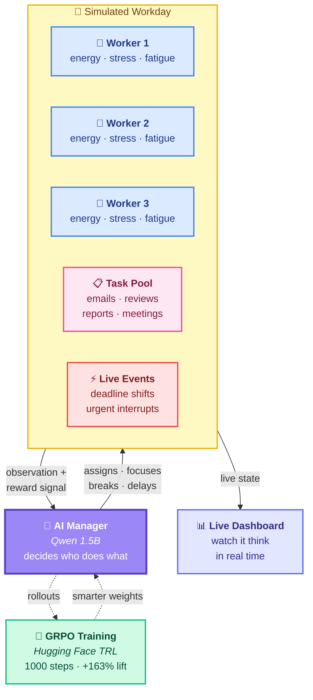

# 🧠 Cognitive Load Manager

> **An AI that schedules work like a *good manager* — one that actually cares if you're tired.**

[](#)
[](#)
[](#)

---

## 🎥 See It In 2 Minutes

| | |
|---|---|
| 🎬 **Project walkthrough** | 👉 [Watch on Loom](https://www.loom.com/share/7c7293efa0ba459ba2de243b0b5aacb2) |
| 📊 **Live dashboard demo** | 👉 [Watch the demo](https://drive.google.com/file/d/149dz_1rIlXv-eR1fwYaxRJ-cV0mQNevJ/view?usp=sharing) |

---

## 🤔 The Problem

Most productivity tools tell you **what** to do.
None of them care **how you're feeling** while doing it.

- Running on 4 hours of sleep? Doesn't matter.
- Just finished three back-to-back meetings? Doesn't matter.
- Operating at 40% because the last task drained you? Doesn't matter.

Real performance isn't a straight line. Fatigue piles up. Stress carries over. Switching between tasks costs you more than you think.

**We built an AI that learns to notice all of that — and schedule around it.**

---

## ✨ What Makes It Special

This is the moment that made the whole project worth it:

> **The AI started giving workers breaks *before* they burned out — not after.**
>
> Nobody told it to do that. It figured it out on its own.

That's the difference between a scheduler that optimizes hours and a manager that actually understands people.

---

## 🛠️ How It Works (In Plain English)

Imagine a simulated office with:

- 👥 **Three workers** — each with their own energy, stress, and fatigue
- 🧑‍💼 **One manager (the AI)** — deciding who does what, and when to call a break
- 📋 **A pile of tasks** — emails, code reviews, reports, meetings, with real deadlines

The AI plays the manager role. Push too hard, workers burn out and quality crashes. Push too soft, deadlines slip. The AI has to find the sweet spot — and keep finding it as the day changes.

And the day **does** change. Mid-shift, a "Production server down!" alert can fire and suddenly every code review is critical. The AI has to adapt on the fly.

---

## 🗺️ How The Pieces Fit Together



**The loop in plain English:**

1. 🧠 **The AI looks** at the workday — who's tired, what's due, what just blew up.
2. 🎯 **It makes a call** — assign, focus, break, switch, or wait.
3. 🏢 **The simulated office reacts** — workers gain progress or burn out, deadlines pass.
4. ↩️ **A reward comes back** — high if the call was wise, low if it wasn't.
5. 🔁 **GRPO uses those rewards** to nudge the AI toward better decisions next time.

After 1000 loops, the AI is **5× better than random guessing**.

---

## 📈 The Results

After training the AI for 1000 steps:

| | Score | What it means |
|---|---|---|
| 🎲 Random guessing | ~0.05 | Total chaos |
| 🤖 Untrained AI | 0.101 | Mediocre |
| ✅ **Our trained AI** | **0.265** | **5× better than random — +163% lift** |

What it learned without being told:

- ⏸️ Insert breaks *before* burnout, not after
- 🎯 Protect deep-focus time — don't yank workers off mid-task
- 🚨 Adapt instantly when priorities flip mid-day

👉 [Watch the full dashboard demo](https://drive.google.com/file/d/149dz_1rIlXv-eR1fwYaxRJ-cV0mQNevJ/view?usp=sharing)

---

## 🔭 Why This Matters

Today, AI tools schedule meetings and triage tickets — but they treat people like robots. CLM is a step toward AI that schedules **for humans, not over them**.

The same idea plugs into:

- 📅 **Work tools** — Slack, Linear, Notion that understand worker capacity
- 🎓 **Education** — tutors that notice when a student is overloaded, not just behind
- 🏥 **Healthcare** — staff schedulers that catch fatigue before it becomes errors

---

## 🚀 Try It

| | |
|---|---|
| 📓 **Re-run our training in your browser** | 👉 [Open in Colab](https://colab.research.google.com/drive/1_OoW4iH1acCni0H9POCcX2pp-6bOorzo?usp=sharing) |
| 🤗 **Live environment** | This Hugging Face Space |
| 📝 **The full build story** | [`blog.md`](./blog.md) |

---

<details>
<summary><strong>🛠️ For Developers — Technical Details</strong></summary>

### Stack

- **Environment:** OpenEnv-compatible RL environment (FastAPI backend, Docker)
- **Training:** Hugging Face TRL with GRPO on **Qwen 1.5B**
- **Frontend:** React live dashboard
- **Difficulty levels:** easy, medium, hard, expert (with deadlines, dependency chains, mid-episode interruptions)

### Actions

| Action | Description |
|---|---|
| `work` | Work on a task at normal pace |
| `focus` | Deep-work mode: 2× progress, 2× energy cost |
| `break` | Rest: +energy, −stress |
| `switch` | Change active task (small penalty) |
| `delay` | Wait one step |

### Scoring Formula

```
score = completion×0.60 + deadline×0.22 + energy×0.10 + dependency×0.05 + interruption×0.03
```

Score is always in (0.01, 0.99).

### Quick Setup

```bash
# Docker
docker build -t clm-env . && docker run -p 7860:7860 clm-env

# Local
pip install -r requirements.txt
uvicorn server.app:app --port 7860 --reload

# React dashboard
cd frontend && npm install && npm run dev
```

### Environment Variables

| Variable | Description |
|---|---|
| `API_BASE_URL` | LLM API endpoint |
| `MODEL_NAME` | Model identifier |
| `HF_TOKEN` | Hugging Face API token |

### Project Structure

```
cognitive-load-manager/
├── models.py          ← Core environment
├── inference.py       ← Baseline LLM agent
├── openenv.yaml       ← OpenEnv spec
├── backend/main.py    ← FastAPI server
├── grader/            ← Difficulty graders
└── frontend/          ← React dashboard
```

For the full technical write-up — observation space, reward shaping table, training loop, and the v1→v2→v3 reward-tuning story — see [`blog.md`](./blog.md).

</details>

---

<p align="center">
  <em>Built for the OpenEnv Hackathon, April 2026.</em><br/>
  <strong>🧠 Scheduling that respects the humans doing the work.</strong>
</p>
