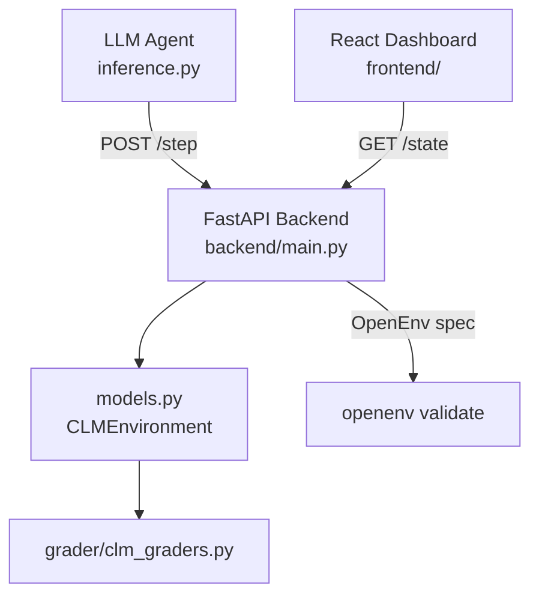

# 🧠 Cognitive Load Manager (CLM)

**A Multi-Agent OpenEnv RL Environment — OpenEnv Hackathon, April 2026**

[](#)
[](#)
[](#)
[](#)
[](#)

---

## 🎥 See It Running First

| | |
|---|---|
| **2-min project walkthrough (Loom)** | 👉 [Watch on Loom](https://www.loom.com/share/7c7293efa0ba459ba2de243b0b5aacb2) |
| **Full dashboard demo (Google Drive)** | 👉 [Watch Demo](https://drive.google.com/file/d/149dz_1rIlXv-eR1fwYaxRJ-cV0mQNevJ/view?usp=sharing) |
| **Training notebook (Colab — re-runnable)** | 👉 [Open in Colab](https://colab.research.google.com/drive/1_OoW4iH1acCni0H9POCcX2pp-6bOorzo?usp=sharing) |

---

## The Problem

Productivity tools are good at one thing: telling you *what* to do. Deadlines, priorities, urgency tags — all mapped out. What none of them do is care whether you're running on four hours of sleep, mid-recovery from three back-to-back meetings, or operating at 40% capacity because the last task drained you.

That gap is real. Performance isn't linear. Fatigue compounds across a workday. Stress from one task bleeds into the next. Context switching has a measurable cognitive cost that most schedulers treat as zero. 

The Cognitive Load Manager is built around that gap. It's a simulation environment where an AI agent learns to schedule work the way a *good manager* would — not just efficiently, but sustainably, with actual awareness of the humans doing the work.

---

## What We Built

CLM is a **multi-agent reinforcement learning environment** built on the OpenEnv interface. It simulates a real knowledge-work day — tasks of different types, deadlines with real consequences, worker states that shift throughout the episode, and mid-session surprises that force the agent to adapt.

The setup:

- **Three worker agents**, each carrying independent internal state: energy level, stress level, current task load, and fatigue accumulation that builds non-linearly across the session
- **One manager agent** — the AI being trained — that observes the full workspace state and makes scheduling decisions every step
- **A task pool** with deadlines, dependency chains, and varying complexity levels (email, code review, reports, meetings, calls)

The manager has to decide who gets what, when to push, when to delay, and when a worker genuinely needs a break. Every call has downstream consequences. Burn a worker out and their output quality drops, stress spikes, and you lose throughput precisely when you need it. Under-assign and deadlines slip. The agent has to find — and maintain — the line between the two.

What makes the environment harder than a standard scheduling problem:

- **Context-switching penalties** — moving between unrelated tasks isn't treated as free. Every switch costs something, and the agent learns to protect focus blocks.
- **Non-linear fatigue accumulation** — workers don't degrade evenly. The drop accelerates as the session progresses.
- **Mid-episode rule changes** — deadlines shift, urgent tasks inject mid-episode, priorities flip. In the live dashboard you can watch a "Schema Drift" alert fire mid-run (*"URGENT: Production server down — all code reviews now critical"*) and see the agent recalibrate in real time. There's no fixed plan to replay; the agent has to actually adapt.

This maps to **Theme 1 (Multi-Agent Interactions)** — three workers with independent states, a manager operating under partial observability, and emergent coordination between scheduling decisions and worker capacity. It also sits squarely in **Theme 3.1 (World Modeling / Professional Tasks)**: the manager is doing genuine orchestration — updating beliefs about worker state, sequencing task workflows, and handling dynamic interruptions through OpenEnv's standard step/reset interface.

---

## 🎯 Why This Environment Matters

No existing RL environment has modeled knowledge-work cognitive load in a principled, agent-evaluatable way. CLM fills that gap:

- **Useful for training agents** that assist with personal productivity tools, calendar management, and task triage systems
- **Useful for evaluating LLM planning ability** — especially multi-step planning under resource constraints and changing conditions
- **Realistic dynamics**: energy, stress, fatigue, and task dependencies create emergent difficulty that pure search algorithms cannot exploit
- **Dense reward signal** across the full trajectory, not just terminal rewards

---

## 🕹️ Actions

| Action | Description | Cost |
|--------|-------------|------|
| `work` | Work on `task_id` at normal pace | Energy ↓ by task type |
| `focus` | Deep-work mode on `task_id`: 2× progress, 2× energy cost | Energy ↓ 2× |
| `break` | Rest: Energy +0.22, Stress −0.18 | None |
| `switch` | Change active task | Small reward penalty |
| `delay` | Wait one step; slight stress relief | None |

Action format:
```json
{"type": "work", "task_id": "m1"}
{"type": "focus", "task_id": "h3"}
{"type": "break", "task_id": null}
```


## 👁️ Observation Space

```json
{
  "tasks": [
    {
      "id": "h1",
      "task_type": "email",
      "priority": "critical",
      "progress": 0.45,
      "deadline": 12,
      "depends_on": null,
      "is_interrupted": false
    }
  ],
  "visible_state": {
    "fatigue_level": "medium",
    "stress_warning": true,
    "energy_level": 0.42,
    "stress_level": 0.71,
    "focus_mode": false,
    "upcoming_deadlines": ["h1", "h3"],
    "blocked_tasks": ["h3"]
  },
  "time_step": 9
}
```

**Key mechanics visible to the agent:**
- `blocked_tasks` — tasks whose `depends_on` parent is not yet complete; agent must not work on these
- `upcoming_deadlines` — tasks with deadline within the next 5 steps
- `focus_mode` — whether the agent is currently in deep-work state


## 📋 Tasks & Baseline Scores

| Level | Tasks | Deadlines | Dependencies | Interruptions | Baseline Score |
|-------|-------|-----------|--------------|---------------|----------------|
| **easy** | 2 (email, report) | None | None | None | **0.856** |
| **medium** | 5 mixed types | Yes (4 tasks) | None | None | **0.523** |
| **hard** | 8 mixed types | Yes (tight) | 3 dependency chains | 2 mid-episode | **0.301** |
| **expert** | 10 mixed types | Yes (very tight) | 5 dependency chains | 3 mid-episode | **0.221** |

Scores produced by heuristic agent (priority + deadline triage with focus mode).
A strong LLM agent should achieve: easy >0.85, medium >0.55, hard >0.35, expert >0.25.


## 🏆 Scoring Formula

```
score = weighted_completion × 0.60
      + deadline_adherence  × 0.22
      + energy_efficiency   × 0.10
      + dependency_bonus    × 0.05
      + interruption_bonus  × 0.03
```

| Dimension | Weight | What it measures |
|---|---|---|
| Task Completion | ×0.60 | Fraction of tasks fully completed, weighted by priority |
| Deadline Adherence | ×0.22 | Bonus for finishing before deadline; penalty for missing it |
| Energy Efficiency | ×0.10 | Penalizes high worker fatigue and stress spikes |
| Dependency Bonus | ×0.05 | Reward for respecting task dependency order |
| Interruption Bonus | ×0.03 | Reward for minimizing context-switching interruptions |

Score is always in **(0.01, 0.99)** — never exactly 0 or 1.

Getting the weights right took several rounds. The energy penalty needed to be strong enough the agent couldn't ignore it, but not so dominant that it started refusing to assign tasks altogether. The final balance produces an agent that *anticipates* stress buildup rather than reacting to it after the fact — which is the behavior you actually want.


## 📊 Reward Shaping Details

Step rewards provide **dense signal** across the full trajectory:

| Event | Reward |
|-------|--------|
| Task progress (normal) | +0.10 × progress_delta × priority_weight |
| Milestone 25% | +0.04 × priority_weight |
| Milestone 50% | +0.07 × priority_weight |
| Milestone 75% | +0.09 × priority_weight |
| Task complete 100% | +0.18 × priority_weight |
| Context switch | −0.07 |
| Work on blocked task | −0.15 |
| Interruption arrives | −0.05 |
| Episode: burnout | −1.0 |
| Episode: all done (on time) | +1.0 |
| Episode: all done (late) | +0.5 |

Early versions of the reward function only rewarded task completion — and the agent learned to grind workers into the ground to hit numbers. Three full rebuilds later, the current structure produces measurably better behavior.

---

## 🤖 Training

We trained using **Hugging Face TRL with GRPO-based reinforcement learning** on a **Qwen 1.5B** base model.

The full training notebook is one click, all dependencies handled, re-runnable end to end:

👉 [Open in Colab](https://colab.research.google.com/drive/1_OoW4iH1acCni0H9POCcX2pp-6bOorzo?usp=sharing)

The training loop:

1. The model (manager agent) receives an observation from the environment
2. It generates an action — structured as a decision over the available action space
3. The action executes in the environment; a reward is returned
4. GRPO updates the model based on relative reward signal across a batch of rollouts

We ran for 1000 steps in the primary training run. The mean reward curve shows the agent moving from near-random behavior in the early steps to a clear upward trend by step 250, stabilizing at a higher plateau through steps 750–1000.

---

## 📈 Results

**Before vs After GRPO** — measured during 1000-step fine-tuning on the CLM environment:

| | Before | After | Lift |
|---|---|---|---|
| Mean Reward | 0.101 | 0.265 | **+163%** |

Per-action reward breakdown after training:

| Action | Reward (After) | What changed |
|---|---|---|
| Focus | 0.249 | Highest — agent learned to protect deep work blocks |
| Work | Improved significantly | Better task-worker matching |
| Break | 0.040 | Positive — agent learned breaks aren't wasted time |
| Delay | 0.019 | Low but selective — used strategically, not as default |

**Episode #1** completed with a final score of **0.3393** across 11 steps on a medium-difficulty workload. The cumulative reward curve shows the agent managing energy and stress while handling a live schema drift event mid-episode. Task queue at close: email (critical, 100% complete), code_review_em2 (normal, 0%), code_review (high, 4%).

What we didn't program but observed: the agent started inserting breaks *before* workers hit the burnout threshold, not after. It also stopped switching workers away from tasks they were mid-focus on unless deadline pressure forced it. Neither of those were explicit rules — just costs in the reward function that the agent discovered independently.

See the full episode replay, reward/step graphs, energy and stress curves, and task progress live in the dashboard demo:

👉 [Full dashboard demo](https://drive.google.com/file/d/149dz_1rIlXv-eR1fwYaxRJ-cV0mQNevJ/view?usp=sharing)

---

## 🏛️ Architecture

```
cognitive-load-manager/
├── models.py          ← Core environment logic (tasks, state, grader, dynamics)
├── inference.py       ← OpenAI-client baseline agent (all 4 difficulty levels)
├── openenv.yaml       ← OpenEnv spec (actions, observations, tasks, scoring)
├── Dockerfile         ← Container definition
├── backend/
│   └── main.py        ← FastAPI app (OpenEnv HTTP server + grade endpoints)
├── server/
│   └── app.py         ← Uvicorn entrypoint
├── grader/
│   └── clm_graders.py ← EasyGrader, MediumGrader, HardGrader, ExpertGrader
└── frontend/          ← React live dashboard (visual state inspector)
```



---

## 🚀 Setup

### Docker (for HF Space / production)
```bash
docker build -t clm-env .
docker run -p 7860:7860 clm-env
```

### Local development
```bash
pip install -r requirements.txt
uvicorn server.app:app --port 7860 --reload
```

### Run inference baseline
```bash
export HF_TOKEN="hf_your_token_here"
export API_BASE_URL="https://router.huggingface.co/v1"
export MODEL_NAME="Qwen/Qwen2.5-72B-Instruct"
python inference.py
```

### Optional: React Dashboard
```bash
cd frontend && npm install && npm run dev
# Visit http://localhost:5173
```


## ⚙️ Environment Variables

| Variable | Description |
|----------|-------------|
| `API_BASE_URL` | LLM API endpoint (e.g. `https://router.huggingface.co/v1`) |
| `MODEL_NAME` | Model identifier (default: `Qwen/Qwen2.5-72B-Instruct`) |
| `HF_TOKEN` | Hugging Face API token |

---

## 🔭 Where This Goes

This started as a hackathon project. The problem it's solving isn't going away.

Near-term: developer-facing APIs that let teams plug human-aware scheduling into tools they already use — Slack, Linear, Notion. Not replacing them. Adding a layer that actually understands worker state.

Longer out: the same environment architecture adapts to other domains where human capacity matters. An adaptive learning system that knows when a student is cognitively overloaded, not just academically behind. A clinical scheduling tool that models physician fatigue before it compounds into errors.

The environment is the foundation. What you train on it is what changes.

---

## 🪞 Honest Reflection

Reward shaping took way longer than it should have. We went through three complete versions before finding something that produced the behavior we actually wanted. If we were starting over, we'd prototype the reward function with a simple heuristic agent first — validate the signal makes sense before involving the LLM at all.

We'd also add worker personalization. Right now all three workers share the same fatigue model. Real people have different capacities, different stress tolerances, different recovery curves. Per-worker profiles that the manager has to individually learn would make this significantly more powerful — and more honest about what human-aware AI actually needs to do.

---

## 🔗 All Links

| Resource | Link |
|---|---|
| 🤗 HF Space (live environment) | Linked above (this Space) |
| 📓 Training Notebook (Colab) | [Open in Colab](https://colab.research.google.com/drive/1_OoW4iH1acCni0H9POCcX2pp-6bOorzo?usp=sharing) |
| 🎥 Dashboard Demo (full video) | [Google Drive](https://drive.google.com/file/d/149dz_1rIlXv-eR1fwYaxRJ-cV0mQNevJ/view?usp=sharing) |
| 🎬 Project Walkthrough (Loom) | [Loom](https://www.loom.com/share/7c7293efa0ba459ba2de243b0b5aacb2) |

---

*Built for the OpenEnv Hackathon, April 2026.*
