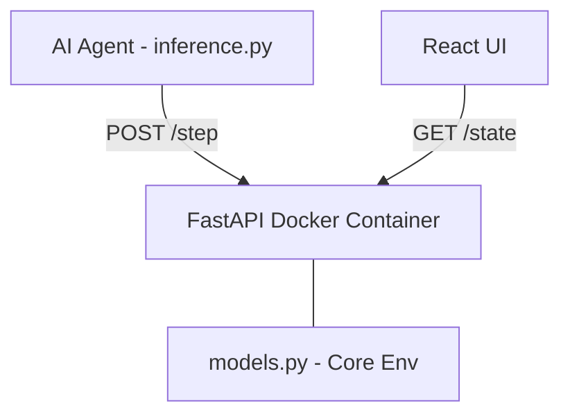

# 🧠 Cognitive Load Manager (CLM) 

**An OpenEnv RL Simulation for the Meta PyTorch Hackathon**

[](#)
[](#)
[](#)
[](#)

Cognitive Load Manager (CLM) is a production-ready, highly compliant **OpenEnv simulation** built to train and evaluate AI agents on human scheduling and workload management.

*This is not a toy game.* CLM accurately simulates human productivity by forcing the AI agent to manage tasks while actively navigating **burnout (energy)**, **deadlines (stress)**, and context switching.

---

## 🎯 The Environment

Your AI agent acts as a task scheduler navigating a psychological puzzle:
- 🔋 **Energy**: Starts at 1.0. Decreases with work. Recovers when taking a break. If energy drops critically low, the agent will suffer from **Burnout** and the simulation fails.
- 📉 **Stress**: Increases as deadlines rapidly approach. High stress severely impacts work efficiency and incurs point penalties.
- 📋 **Tasks**: Generated dynamically. Harder levels feature frequent interruptions and overlapping deadlines.
- 🕹️ **Actions**: The agent must output JSON actions mapping to `work`, `break`, `switch` (focus), or `delay`.

---

## 🚀 Setup & Installation 

This project requires **Docker** and comes fully compliant with the Meta OpenEnv baseline validator.

### 1. Start the Environment Server
Build and run the FastAPI simulation backend locally:
```bash
docker build -t clm-env-backend .
docker run -p 8000:8000 clm-env-backend
```
*(The server binds to `localhost:8000`)*

### 2. Configure Your Keys
Rename `.env.example` to `.env` or create a new `.env` file at the root. You **must** provide a Hugging Face token (No OpenAI keys are required):
```env
HF_TOKEN="hf_your_hugging_face_token_here"
```

### 3. Run the AI Agent (Inference Baseline)
In a secondary terminal, execute the strictly OpenEnv-compliant inference baseline:
```bash
# Install the minimal agent dependencies
pip install openai python-dotenv requests

# Start the evaluation run
python inference.py
```
> The script inherently defaults to the hackathon's standard `Qwen/Qwen2.5-72B-Instruct` model routed automatically through Hugging Face. You should see `[START]`, `[STEP]`, and `[END]` outputs matching the exact grading specification!

---

## 💻 Optional: Web Dashboard
If you want to view the state visually:
```bash
cd frontend
npm install
npm run dev
```
Navigate to `http://localhost:5173` to interact with the environment dashboard manually!

---

## 🏛️ Project Architecture
- **Environment Logic**: Mapped seamlessly into the root `models.py` to abide by OpenEnv protocols.
- **REST Engine**: FastAPI router translating OpenEnv schemas into a scalable local container endpoints.
- **Inference**: `inference.py` handles the rigid STDOUT sequence logic and LLM history tracking.


