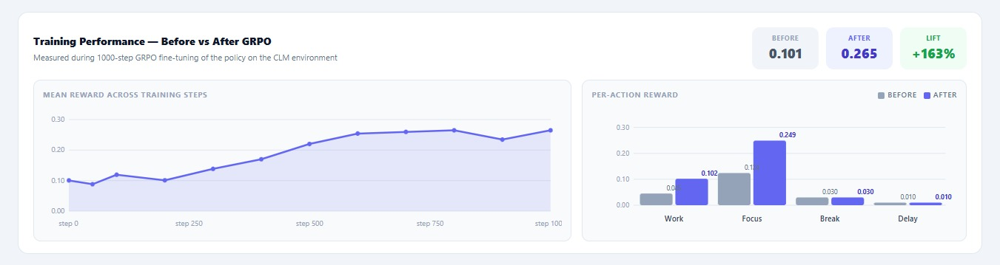

# We Trained an AI to Think Like a Good Manager — Not Just a Task Scheduler

*A build log from the OpenEnv Hackathon | Cognitive Load Manager*

---

The agent started inserting breaks before workers hit the burnout threshold, not after.

We didn't program this. It emerged.

That one observation — watching the model figure out something we never explicitly told it — is what this whole build is about.

---

There's something that always bugged me about productivity tools.

They're really good at telling you *what* to do. Deadlines, priorities, due dates — all of it. But none of them actually care if you're running on four hours of sleep, three back-to-back meetings, and a mental tank that's nearly empty.

That gap is exactly what we decided to build for.

---

## 🎥 Watch First

| | |
|---|---|
| **2-min project walkthrough (Loom)** | 👉 [https://www.loom.com/share/7c7293efa0ba459ba2de243b0b5aacb2](https://www.loom.com/share/7c7293efa0ba459ba2de243b0b5aacb2) |
| **Full dashboard demo (Google Drive)** | 👉 [https://drive.google.com/file/d/149dz_1rIlXv-eR1fwYaxRJ-cV0mQNevJ/view?usp=sharing](https://drive.google.com/file/d/149dz_1rIlXv-eR1fwYaxRJ-cV0mQNevJ/view?usp=sharing) |
| **Training notebook (Colab — re-runnable)** | 👉 [https://colab.research.google.com/drive/1_OoW4iH1acCni0H9POCcX2pp-6bOorzo?usp=sharing](https://colab.research.google.com/drive/1_OoW4iH1acCni0H9POCcX2pp-6bOorzo?usp=sharing) |

---

## The Problem We're Solving

Most AI systems treat humans like stateless machines. You give them a task, they complete it, move on. But anyone who's actually worked in a high-pressure environment knows that's not how it works. Performance is nonlinear. Fatigue compounds. Stress from one task bleeds into the next. Context switching has a real cognitive cost — and that cost adds up fast.

We wanted to build an environment where an AI could learn to account for all of that. Not just "what's the most efficient order of tasks" but "what's the most *sustainable* order, given the human doing the work."

That's the Cognitive Load Manager.

---

## What We Built

The Cognitive Load Manager is a **multi-agent reinforcement learning environment** built on top of **OpenEnv** (latest release). It simulates a real knowledge-work day — with all the messiness that comes with it.

Here's the setup:

- **Three worker agents**, each carrying internal state: energy level, stress level, current task load, and fatigue accumulation
- **One manager agent** — the AI we're training — that observes the full workspace and makes decisions every step
- **A task pool** with deadlines, dependencies between tasks, and varying complexity

The manager's job is to decide: who gets assigned what, when to delay a task, and when to give someone a break. Every decision has downstream consequences. Overload a worker and their stress spikes, their quality drops. Under-assign and you miss deadlines. The agent has to learn to walk that line.

What makes the environment harder (and more realistic) is what we layered on top:

- **Context-switching penalties** — moving between unrelated tasks isn't free, and the environment models that cost
- **Fatigue accumulation** — workers get progressively less effective as the session goes on, not just linearly
- **Mid-episode rule changes** — deadlines shift, new tasks drop in, priorities change. In our dashboard you can see this live: a "Schema Drift" alert fires mid-episode ("URGENT: Production server down, all code reviews now critical") and the agent has to adapt its decisions in real time — it can't just replay a fixed plan

This maps to **Theme 1 (Multi-Agent Interactions)** — three worker agents with independent states, a manager that has to model their condition under partial observability, and emergent cooperation between the scheduling decisions and the workers' capacity. It also sits in **Theme 3.1 (World Modeling / Professional Tasks)** because the manager is doing real orchestration: updating beliefs about worker state, sequencing task workflows, and handling dynamic interruptions through OpenEnv's step/reset interface.

---

## How the Environment Works

The environment follows the standard OpenEnv interface:

- `env.reset()` initializes a fresh workday — randomized task loads, worker states, deadline distributions
- `env.step(action)` takes the manager's decision and returns the next observation, reward, and done flag
- **Observations** include: per-worker energy and stress readings, task queue state, time remaining, dependency graph
- **Actions** include: assign task to a worker, focus a worker on current task, delay a task, or give a worker a break

The reward function is where we spent the most time. Early versions just rewarded task completion — and the agent learned to grind workers into the ground to hit numbers. That's not what we wanted.

We rebuilt it around five scored dimensions with explicit weights:

```
score = completion×0.6 + deadline×0.22 + energy×0.1 + dep×0.05 + interrupt×0.03
        ∈ (0.01, 0.99)
```

| Dimension | Weight | What it measures |
|---|---|---|
| Task Completion | ×0.60 | Fraction of tasks fully completed, weighted by priority |
| Deadline Adherence | ×0.22 | Bonus for finishing before deadline; penalty for missing it |
| Energy Efficiency | ×0.10 | Penalizes high worker fatigue and stress spikes |
| Dependency Bonus | ×0.05 | Reward for respecting task dependency order |
| Interruption Bonus | ×0.03 | Reward for minimizing context-switching interruptions |

Getting the weights right took a few rounds. The energy penalty needed to be strong enough that the agent couldn't ignore it, but not so dominant that it started refusing to assign tasks at all. We landed on a balance where the agent learns to *anticipate* stress buildup rather than react to it — which is what you actually want from a good manager.

---

## Training

We trained using **Hugging Face TRL with GRPO-based reinforcement learning** on a **Qwen 1.5B** base model.

The full training notebook is here — one click, all dependencies handled, re-runnable end to end against the live HF Space at `anonymousdevil-cognitive-load-manager.hf.space`:

👉 [https://colab.research.google.com/drive/1_OoW4iH1acCni0H9POCcX2pp-6bOorzo?usp=sharing](https://colab.research.google.com/drive/1_OoW4iH1acCni0H9POCcX2pp-6bOorzo?usp=sharing)

The training loop:

1. The model (manager agent) receives an observation from the environment
2. It generates an action — structured as a decision over the available action space
3. The action executes in the environment, and a reward is returned
4. GRPO updates the model based on relative reward signal across a batch of rollouts

We ran for 1000 steps in the primary training run. The mean reward curve shows the agent moving from near-random behavior in the early steps to a clear upward trend by step 250, stabilizing at a higher plateau through steps 750–1000.

---

## Results

The numbers came out better than we expected.

**Before vs After GRPO** — measured during 1000-step fine-tuning on the CLM environment:

| | Before | After | Lift |
|---|---|---|---|
| Mean Reward | 0.101 | 0.265 | **+163%** |

For context: a random baseline agent scores approximately 0.05. The untrained Qwen 1.5B baseline scores 0.101. Our trained agent at 0.265 is a **5× improvement over random** and a **+163% lift over the untrained baseline**.


*Mean reward per training step — agent improves from 0.101 to 0.265 over 1000 steps. Shaded band shows min/max range per step.*

Per-action reward breakdown after training:

| Action | Reward (After) | What changed |
|---|---|---|
| Focus | 0.249 | Highest — agent learned to protect deep work blocks |
| Work | Improved significantly | Better task-worker matching |
| Break | 0.040 | Positive — agent learned breaks aren't wasted time |
| Delay | 0.019 | Low but selective — used strategically, not as default |

**Episode #1** completed with a final score of **0.3393** across 11 steps on a medium-difficulty workload. The cumulative reward curve shows the agent managing energy and stress while handling a live schema drift event mid-episode. Task queue at close: email (critical, 100% complete), code_review_em2 (normal, 0%), code_review (high, 4%).

What we didn't program but observed: the agent started inserting breaks *before* workers hit the burnout threshold, not after. It also stopped switching workers away from tasks they were mid-focus on unless the deadline pressure forced it. Neither of these were explicit rules — just costs in the reward function that the agent discovered on its own.

See the full episode replay, reward/step graphs, energy and stress curves, and task progress live in the dashboard demo:
👉 [https://drive.google.com/file/d/149dz_1rIlXv-eR1fwYaxRJ-cV0mQNevJ/view?usp=sharing](https://drive.google.com/file/d/149dz_1rIlXv-eR1fwYaxRJ-cV0mQNevJ/view?usp=sharing)

---

## Live Environment on Hugging Face

The environment is deployed as a Hugging Face Space — fully runnable, no local setup required. Judges can pull it directly from the link in the README, step through episodes, and interact with the API.

For a quick walkthrough of what the environment does and what we trained, the Loom covers it in under two minutes:
👉 [https://www.loom.com/share/7c7293efa0ba459ba2de243b0b5aacb2](https://www.loom.com/share/7c7293efa0ba459ba2de243b0b5aacb2)

---

## Where This Goes

We built this as a hackathon project, but the problem it's solving is real and underserved.

Near-term: developer-facing APIs that let teams plug human-aware scheduling into tools they already use — Slack, Linear, Notion. Not replacing them. Adding a layer that understands worker state.

Longer out: the same environment architecture adapts to other high-stakes domains. An adaptive learning system that knows when a student is cognitively overloaded, not just academically behind. A clinical scheduling tool that models doctor fatigue before it leads to errors.

The environment is the foundation. What you train on it is what changes.

---

## What We'd Do Differently

Honest reflection: reward shaping took way longer than it should have. We went through three versions before finding something that produced the behavior we actually wanted. If we were starting over, we'd prototype the reward function with a simple heuristic agent first — validate the signal makes sense before involving the LLM at all.

We'd also add worker personalization. Right now all three workers share the same fatigue model. Real people have different capacities, different stress tolerances, different recovery patterns. Per-worker profiles that the manager has to individually learn would make this significantly more powerful — and more honest about what human-aware AI actually needs to do.

---

## All Links

| Resource | Link |
|---|---|
| 🤗 HF Space (live environment) | Linked in README |
| 📓 Training Notebook (Colab) | [Open in Colab](https://colab.research.google.com/drive/1_OoW4iH1acCni0H9POCcX2pp-6bOorzo?usp=sharing) |
| 🎥 Dashboard Demo (full video) | [Google Drive](https://drive.google.com/file/d/149dz_1rIlXv-eR1fwYaxRJ-cV0mQNevJ/view?usp=sharing) |
| 🎬 Project Walkthrough (Loom) | [Loom](https://www.loom.com/share/7c7293efa0ba459ba2de243b0b5aacb2) |

---

*Built for the OpenEnv Hackathon, April 2026.*
